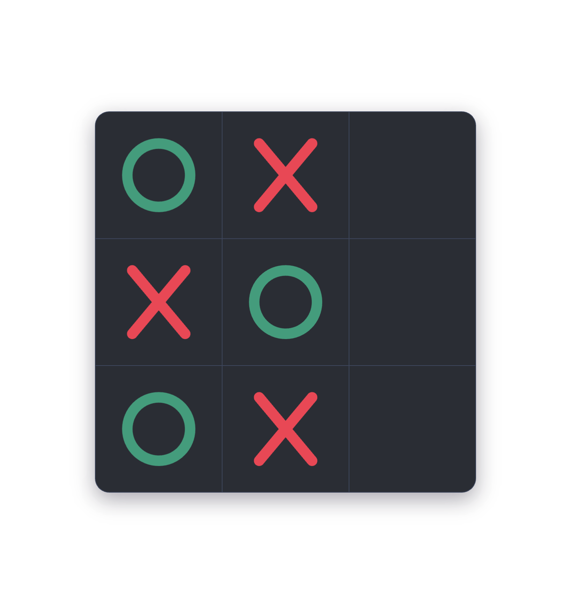
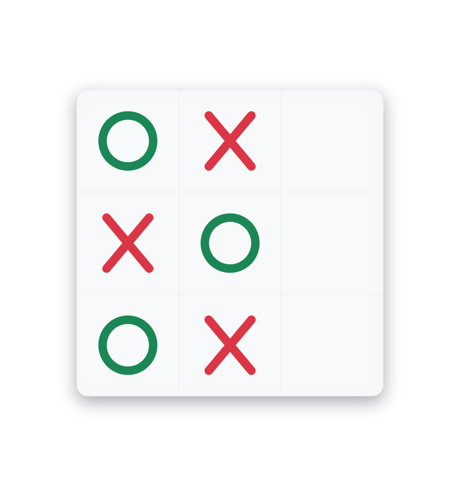

# JS Tic Tac Toe

Javascript implementation of the game [Tic Tac Toe](https://en.wikipedia.org/wiki/Tic-Tac-Toe).

	

		
	

    

        
    	&nbsp;&nbsp;&nbsp;
        
    

	<a href="https://leandrosq.github.io/js-tic-tac-toe/">Live demo</a>

## How to play

Just click on the cells on the 3x3 grid, each click consists in one turn.

The first player to get three connected cells in a straight line wins.

## Project features

- Light and Dark mode
- Mobile support
- Vanilla JS
- Player vs Player
- Player vs AI
- Sound effects
- Animations

## External/Thanks to

| Name | Description |
| -- | -- |
| Eslint | For linting and semantic analysis |
| Jest | For unit testing |
| [Font awesome](https://fontawesome.com/icons) | For the X and O icons|
| Github actions | For CI, building and deploying to github pages |
| [Google fonts](https://fonts.google.com/) | For the [Poiret One](https://fonts.google.com/specimen/Poiret+One) font |
| [flaticon](https://www.flaticon.com/free-icons/tic-tac-toe) | Tic tac toe icons created by Freepik - Flaticon |
| [maketext.io](https://maketext.io/) | For Generating this awesome header |
| [Freesound.org](https://freesound.org/) | For providing creative commons audio FX |
| [Minimax algorithm](https://en.wikipedia.org/wiki/Minimax) | For providing decision tree logic, which controls the AI |
